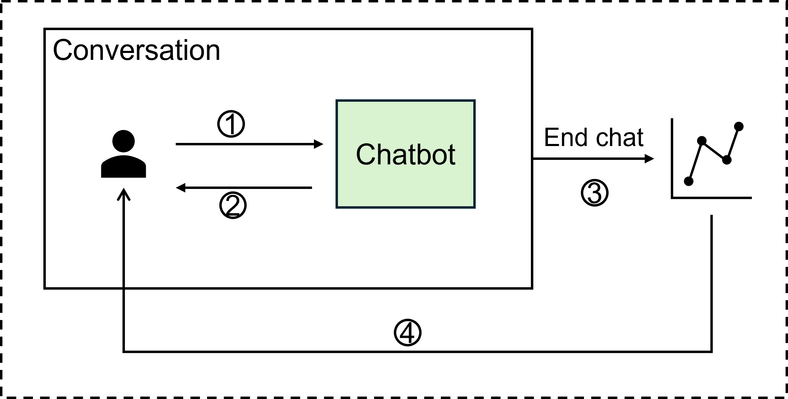
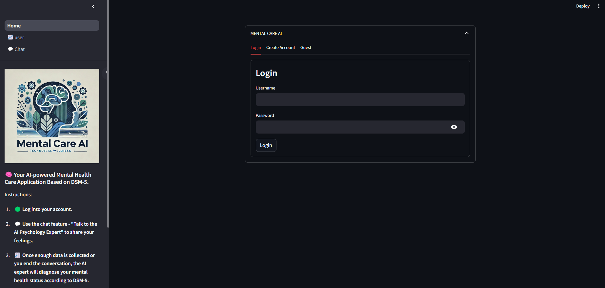
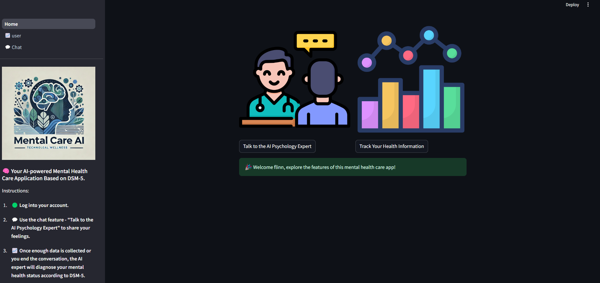
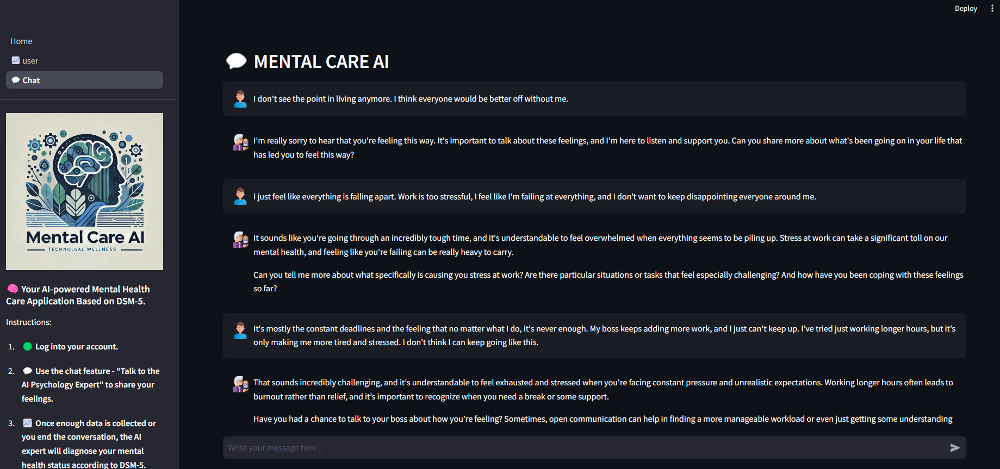
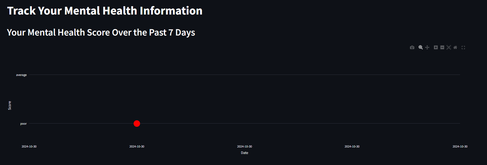
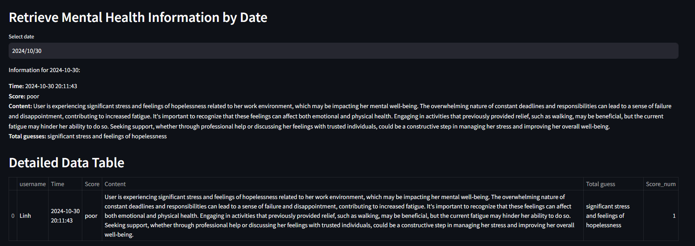

# Mental-Care-AI


## Mental Health Support System using RAG and LlamaIndex

## Project Overview
This project is in the **brainstorming** and **early concept** phase, exploring the potential for a smart mental health support system using Retrieval-Augmented Generation (RAG) and LlamaIndex. The system aims to provide virtual counseling, assist in diagnostics based on DSM-5, and track users' mental health progress.

## Getting Started

### 0. Clone the Repository and Navigate to the Project Folder

First, clone this repository to your local machine and navigate to the project folder. For example:

```sh
git clone https://github.com/NguyenHuy190303/Mental-Care-AI.git
cd Mental-Care-AI
```

### 1. Create and Activate a Conda Environment

```sh
conda create -n mental_env python=3.11
conda activate mental_env
```

### 2. Set Up OpenAI API Key

Create a `.streamlit` folder in the root directory, and add a `secrets.toml` file:

```toml
[openai]
OPENAI_API_KEY = "sk-your-api-key"
```

### 3. Install Required Libraries

```sh
pip install -r requirements.txt
```

### 4. Run the Application Locally

```sh
streamlit run Home.py
```

## Docker Setup

### 1. Building the Docker Image

To containerize the application, use:

```sh
docker build -t mental-care-ai .
```

### 2. Running the Docker Container

Run the container, mapping port `8501` to access the Streamlit app:

```sh
docker run -p 8501:8501 mental-care-ai
```

### 3. Managing Secrets in Docker

To securely pass your OpenAI API key:

- **Option 1:** Use an environment variable when running the container:

  ```sh
  docker run -p 8501:8501 -e OPENAI_API_KEY="sk-your-api-key" mental-care-ai
  ```

- **Option 2:** Use a `.env` file:

  ```plaintext
  # .env file
  OPENAI_API_KEY=sk-your-api-key
  ```

  Then run the container with:

  ```sh
  docker run -p 8501:8501 --env-file .env mental-care-ai
  ```

## System

### 1. App Build:


### 2. Pipeline:



### 3. How Agent works:


### 4. Data Processing:


## User Interface Demo

### Login UI:



### Home UI:



### Chat UI:



### User Mental Health Score UI Sample:



### Detailed Data Table of User Mental Health UI Sample:


